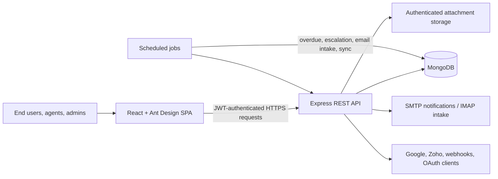

# Incident Management Portal — Project Report

**Project type:** Full-stack web application  
**Architecture:** MERN-style client/server application  
**Prepared:** 21 September 2026  
**Repository:** `incident-management-portal-v3`

## 1. Executive summary

The Incident Management Portal is a web application for recording, assigning,
tracking, resolving, and analysing IT/service incidents. It provides separate
experiences for end users, support agents, and administrators. Beyond basic
ticketing, the project implements operational features such as SLA deadlines,
on-call acknowledgement and escalation, problem management, root-cause
analysis (RCA), action items, knowledge-base articles, post-resolution
customer-satisfaction surveys, notifications, attachments, email/webhook
intake, and a documented public API.

The frontend is a React single-page application (SPA); the backend is an
Express REST API backed by MongoDB through Mongoose. Authentication, access
control, validation, activity records, and scheduled jobs are handled by the
backend so that business rules are not dependent on the browser.

## 2. Purpose and objectives

Service teams often lose visibility when issues are reported through separate
emails, messages, and spreadsheets. This portal creates one controlled record
for each incident and supports its complete life cycle.

The main objectives are to:

- let users report and follow their own issues;
- allow support staff to prioritise, assign, and resolve work efficiently;
- enforce consistent workflows and service-level targets;
- retain collaboration, evidence, and audit history in the incident record;
- convert repeated incidents into managed problems, known errors, and reusable
  knowledge articles; and
- expose selected resources to approved external clients through OAuth 2.0.

## 3. Users and access levels

| Role | Main permissions |
| --- | --- |
| End User | Register/sign in, create incidents, see authorised incident information, participate in public comments, view knowledge articles, and complete a post-resolution survey. |
| Support Agent | Work from a queue, update assigned incidents, collaborate internally, manage problem/RCA work allowed to staff, use on-call functions, and view operational dashboards. |
| Administrator | All operational visibility plus user, category, department, OAuth-client, and intake-failure administration; cross-agent workload access; and restricted destructive actions. |

The UI uses protected and role-specific routes to avoid presenting unavailable
screens. The API independently applies authentication and role checks, which
is the authoritative control.

## 4. Technology stack

| Layer | Technology | Responsibility |
| --- | --- | --- |
| Frontend | React 19, Vite, React Router, Ant Design | SPA pages, route protection, forms, tables, charts, layout, and user interactions. |
| Frontend utilities | Axios, Day.js, Tiptap, Ant Design Charts, html2canvas | API calls, dates, rich-text KB authoring, analytics, and image capture/export support. |
| Backend | Node.js (18+), Express 5 | REST API, routing, validation, middleware, and business services. |
| Database | MongoDB with Mongoose | Persistent documents, references, schema validation, indexes, and virtual fields. |
| Authentication | JWT, bcryptjs, Google OAuth, Zoho OAuth | Portal login, password hashing, and optional single sign-on. |
| API protection | OAuth 2.0 client credentials, scopes, credits, rate limiting | Controlled external API access. |
| Files and mail | Multer, Nodemailer, IMAPFlow, MailParser | Attachment handling, notification email, and monitored-mailbox intake. |
| Documentation and quality | Swagger/OpenAPI, Node test runner, Vitest, ESLint | API documentation, automated checks, and frontend quality tooling. |
| Deployment configuration | Vercel configuration in both applications | Serverless/frontend deployment support. |

## 5. High-level architecture



The SPA is responsible for presentation and user interaction. Express exposes
versioned routes under `/api/v1`, validates requests, applies permissions, and
calls services/controllers. Mongoose models centralise persistence rules.
Background jobs process overdue incidents and action items, escalation,
monitored email intake, and Zoho synchronisation.

## 6. Main modules and implemented functions

### 6.1 Authentication and account management

- Local registration and login use hashed passwords (`bcryptjs`) and JWTs.
- Google SSO and Zoho authentication callback pages are present in the SPA;
  related backend routes/services support the provider flows.
- User profiles and administration screens support account management.
- Accounts have an active/inactive state and three portal roles.
- Security-sensitive password fields are configured not to appear in normal
  query results.

### 6.2 Incident management

An incident includes an automatically generated number such as `INC-000001`,
title, description, category, priority, reporter, assignee, department,
status, timestamps, resolution note, and intake source. It can be reported
manually or created from email/webhook intake.

Supported workflow states are:

```text
New → In Progress → On Hold / Resolved / Closed
On Hold → In Progress / Resolved / Closed
Resolved → Closed or reopened to In Progress
Closed is final; a recurrence is created as a new linked incident.
```

The backend defines and validates permitted state transitions. Incident lists
support filtering, search, pagination, CSV export, recent-incident views, and
dashboard analytics. An end user’s view is restricted to incidents they are
allowed to see; staff views support operations work.

The lifecycle includes New, Assigned, Acknowledged, Investigating (the stored
`in_progress` state), On Hold, Resolved, Closed, Cancelled, and Duplicate.
On Hold requires a reason, including Awaiting Customer or Awaiting Vendor.
Resolved incidents may be reopened to Investigating. Closed is final: a later
recurrence must be raised as a new incident and linked to the closed record.
Duplicate incidents retain a link to their original incident.

### 6.3 Priority and SLA management

The portal presents its existing stored priority values as P1-P4: P1/Critical,
P2/High, P3/Medium, and P4/Low. New portal submissions derive priority from a
central Impact x Urgency matrix: High/High=P1; High/Medium or High/Low=P2;
Medium/High=P2; Medium/Medium, Medium/Low, or Low/High=P3; and Low/Medium or
Low/Low=P4. The requester cannot directly choose a calculated priority.
Existing records and legacy API clients using the four stored priority values
remain compatible.

Resolution SLA targets are P1 4 hours, P2 8 hours, P3 24 hours, and P4 72
hours. The implementation uses elapsed 24x7 time, not a business-hours
calendar. Each incident also has an acknowledgement deadline based on the
active on-call acknowledgement window (15 minutes by default, or a configured
roster value). The API exposes separate acknowledgement and resolution SLA
states. On Hold requires a reason, pauses both clocks, and extends deadlines
by the hold duration on resume; pause/resume activity is audited.

### 6.4 Assignment, on-call, and escalation

- Incidents may be assigned to a user and/or department.
- Assignment-option endpoints support selecting an eligible handler.
- On-call schedules define department/category coverage, start/end times,
  acknowledgement windows, and escalation chains.
- Incidents record acknowledgement details, escalation level, and last
  escalation time. The default acknowledgement window is 15 minutes.
- A selection service considers on-call eligibility and workload, with fallback
  to eligible department staff when a roster is unavailable.

Assignment determines ownership; escalation is a separate on-call response
process. The roster's acknowledgement window and ordered responders drive
escalation of unacknowledged Critical alerts. Configured responders can model
the technical L1 -> L2 -> L3/vendor and management Team Lead -> Incident
Manager -> Delivery Head paths. No fixed organisation-wide escalation threshold
is claimed because the repository does not configure one.

### 6.5 Collaboration and evidence

- Comments may be public or internal. Internal comments are intended for
  agents and administrators only.
- Attachments retain their original name, server-side stored name, type, size,
  uploader, and upload time. Downloads use an authenticated route instead of
  exposing the file directory directly.
- Activity logs record events such as creation, assignment, status/priority
  changes, comments, attachment changes, RCA/action-item events, and KB links.
- Incidents can be linked to other incidents and can surface correlation
  suggestions for review.

### 6.6 Problem, known-error, and RCA management

Repeated or underlying issues can be handled as Problems. A problem progresses
through New, Investigating, Known Error, and Resolved states, with controlled
transitions and incident linking. The Known Error Database is exposed as its
own authenticated view.

An RCA belongs to exactly one incident or one problem. It captures a root-cause
category, description, Five Whys fields, contributing factors, corrective and
preventive actions, author/reviewer information, and review state. RCA states
are Draft, In Review, Approved, and Returned.

### 6.7 RCA action items

### 6.6.1 Major incidents

Support staff can declare a P1/Critical incident a Major Incident. The record
captures the declarer, declaration time, reason, Incident Manager, optional
bridge/channel reference, and optional update cadence, and adds an activity
entry. Existing incident linking supports child incidents under a major
incident. The RCA and action-item workflow provides the post-incident review
and corrective/preventive action record. No regulatory reporting deadline is
configured or claimed.

Action items belong to an RCA and contain an owner, due date, description,
completion evidence, and status. Their statuses are Open, In Progress, Done,
and Overdue. They include due-soon/overdue notification timestamps and are
summarised on the staff dashboard. This turns RCA findings into accountable
follow-up work.

### 6.8 Knowledge base

Knowledge-base articles support title, rich body content, categories, tags,
author, helpful/not-helpful counts, and statuses Draft, Published, Retired,
and Archived. A weighted text index favours title and tags during search. The
portal provides article listing, detail, creation/editing, feedback, and
suggestions. Published articles can be linked to compatible incidents and
problems to assist resolution and prevent repeat work.

### 6.9 Notifications, surveys, and analytics

- The notification system supports incident creation, assignment, status
  change, comments, overdue incidents, and action-item events.
- Resolving an incident can create one post-resolution survey for the reporter.
  Survey scores range from 1 to 5 and may include free-text feedback.
- Low ratings under a configurable threshold (default 3) flag the survey and
  incident for follow-up.
- Dashboard endpoints expose summary figures, charts, recent incidents,
  advanced analytics, staff action-item summary, and admin workload data.

  The advanced endpoint calculates MTTA, MTTR, acknowledgement and resolution
  SLA compliance, reopen rate, backlog-age buckets, and duplicate-linked repeat
  incidents using incident timestamps and records; it does not return static
  KPI values.

### 6.9.1 Current operational limitations

- Automatic closure of Resolved incidents is not implemented. The configurable
  auto-close period requested by the review therefore remains a follow-up item.
- The on-call roster supplies configurable acknowledgement windows and ordered
  escalation responders. Separate configurable resolution-escalation thresholds
  and named organisation-wide L1/L2/L3/vendor and management role templates are
  not yet implemented.

### 6.10 Integrations and external API

- Email intake can parse monitored inbox messages into incidents, record
  intake logs, avoid duplicates using message identifiers, and capture
  allowed attachments.
- Webhook routes and delivery/subscription models support event-driven intake
  and outbound/integration scenarios.
- Zoho services include OAuth and people synchronisation; Google services
  support SSO.
- A public OAuth 2.0 client-credentials API has separately signed access
  tokens, scopes, daily credit limits, client administration, and ticket,
  contact, agent, department, and article resources.

## 7. Data design

The following entities are evident from the Mongoose models:

| Entity | Key information and relationships |
| --- | --- |
| User | Identity, email, hashed password, role, active state, Google/Zoho identifiers. |
| Incident | Central record; references reporter, category, assignee, department, problem, and KB articles. |
| Category / Department / DepartmentUser | Administrative classification, department membership, and ownership. |
| Comment / Attachment / ActivityLog / Notification | Collaboration, evidence, audit trail, and alerts around incidents. |
| Problem / RootCauseAnalysis / ActionItem | Underlying-issue investigation, RCA, and accountable remediation. |
| KnowledgeBaseArticle / ArticleFeedback | Published support knowledge and user feedback. |
| OnCallSchedule | Coverage period, acknowledgement window, and escalation chain. |
| PostResolutionSurvey | One survey per incident, score, comments, lifecycle, and follow-up flag. |
| IncidentLink / IncidentCorrelationSuggestion | Relationships and suggested relationships between incidents. |
| IntakeLog | Monitoring and outcomes of inbound intake. |
| OAuthClient / ApiUsage / WebhookSubscription / WebhookDelivery | External API clients, quotas, and webhook delivery records. |

Indexes are used on common filtering and relationship fields such as incident
number, status, priority, assignee, reporter, due date, survey status, and
action-item owner. The incident model also uses compound indexes for common
list/queue patterns.

## 8. REST API overview

The API uses the `/api/v1` prefix. Swagger UI is served at `/api-docs`, with
the machine-readable specification available at `/api-docs.json`. Key route
groups include:

| Route group | Purpose |
| --- | --- |
| `/auth`, `/users` | Account registration, sign-in, profile and user administration. |
| `/incidents` | Incident CRUD, status/assignment actions, CSV export, comments, attachments, links, RCA, and KB links. |
| `/problems`, `/known-errors`, `/action-items` | Problem workflow, known errors, RCA-related follow-up actions. |
| `/kba`, `/articles` | Portal knowledge base and public article API. |
| `/dashboard`, `/notifications` | Role-scoped operational summaries and notifications. |
| `/categories`, `/departments`, `/teams`, `/agents`, `/on-call` | Reference data, team administration, and on-call operations. |
| `/surveys`, `/intake`, `/webhooks` | CSAT surveys, inbound intake, and webhook handling. |
| `/tickets`, `/contacts`, `/oauth` | External/client-facing ticket/contact APIs and OAuth client-credentials flow. |

## 9. Security and reliability controls

- Helmet security headers and disabled `X-Powered-By` header.
- CORS allow-list based on configured client origins and credential support.
- JWT authentication and server-side role authorisation.
- OAuth bearer tokens have a separate signing secret in production, scopes,
  expiration, and credit-limit controls.
- Password hashes rather than plaintext passwords; password field excluded by
  default from query output.
- Request sanitisation, body-size limits, express-validator validation, and
  consistent error handling.
- General API rate limiting plus a tighter limiter for login, registration,
  and OAuth-token issuance.
- Configurable upload MIME allow-list, file-size limit (default 5 MB),
  generated storage names, and permission-checked downloads.
- Startup validation requires `MONGO_URI` and `JWT_SECRET`; production enforces
  minimum secret lengths and a distinct OAuth secret.
- Graceful shutdown disconnects from MongoDB and logs process failures.

## 10. Frontend pages

The SPA contains public Login, Registration, Google/Zoho callback, and Survey
pages. Authenticated views include Dashboard, Incident List/Create/Detail,
Profile, API Documentation, Knowledge Base list/detail/editor, and error/
forbidden pages. Staff views add My Queue, On-Call, Problems, Known Errors,
and problem detail/create pages. Administrator views add Users, Categories,
Departments, OAuth Clients, and Intake Failures. Pages are lazy loaded to
reduce first-load cost and are wrapped in an error boundary.

## 11. Installation and local execution

### Prerequisites

- Node.js 18 or later
- MongoDB instance or MongoDB Atlas connection string
- npm

### Backend

1. Go to `backend` and install dependencies with `npm install`.
2. Create `backend/.env` and configure at least `MONGO_URI` and `JWT_SECRET`.
3. Optionally configure client URL, mail, OAuth, Google, Zoho, upload, and
   rate-limit settings.
4. Start development mode with `npm run dev`, or use `npm start`.
5. Optionally seed data with `npm run seed` **only when its reset behaviour is
   appropriate**, because the seed configuration defaults to resetting data.

### Frontend

1. Go to `frontend` and install dependencies with `npm install`.
2. Start the Vite development server with `npm run dev`.
3. Create an optimised production bundle with `npm run build`.

Ensure the frontend origin is included in backend `CLIENT_URL` and the frontend
API base URL targets the running backend.

## 12. Verification performed

The following verification was performed while preparing this report:

| Check | Result | Evidence / note |
| --- | --- | --- |
| Repository structure and source inspection | Completed | Frontend, backend, route definitions, models, configuration, and tests were reviewed. |
| Frontend production build | Passed | `npm --prefix frontend run build` completed successfully; Vite transformed 7,800 modules. |
| Backend automated test command | Not currently runnable end-to-end | `npm test` was started, but suites expecting an API at `localhost:5000` failed with connection refused and at least `kb.test.js` could not load `mongodb-memory-server`. Some standalone tests passed, including on-call selection and Google OAuth cases. |

The frontend build reports large generated vendor chunks (notably chart and
Ant Design bundles). This is not a build failure, but it is a performance
optimisation opportunity.

## 13. Known verification limitations and recommendations

1. Add `mongodb-memory-server` as a development dependency, or document and
   automate the required test database/service setup.
2. Ensure the test command starts a disposable API/database environment before
   suites that issue HTTP requests to port 5000.
3. Add continuous-integration jobs for backend tests, frontend tests/lint, and
   production builds.
4. Split or defer heavy chart/UI vendor bundles further to improve initial-load
   performance.
5. Use the implemented Wasabi storage provider for production uploads and
   manage credentials, object retention, backup, and least-privilege bucket access
   according to the organisation's evidence-retention policy.
6. Keep environment secrets out of version control and rotate OAuth/JWT
   secrets according to deployment policy.

## 14. Conclusion

This project is a substantial incident-management solution rather than a
simple ticket form. Its codebase contains a complete incident workflow,
role-aware access, SLA and escalation support, evidence and audit features,
problem/RCA/action-item governance, a searchable knowledge base, CSAT
feedback, integration routes, and a public OAuth-protected API. The frontend
production build is verified. Before release, the automated backend test
environment should be completed so the broad existing test suite can run
reliably in a reproducible environment.

## 15. Wasabi cloud attachment-storage enhancement

The attachment module now supports Wasabi cloud object storage through its
S3-compatible API. Local disk storage remains available and is the default,
so existing deployments and attachment records continue to work.

### Storage flow

- The application selects local or Wasabi storage from `STORAGE_PROVIDER`.
- In Wasabi mode, browser files are held in Multer memory storage and then
  uploaded to Wasabi. They are not persisted first in the application upload
  directory.
- Objects are stored with incident-scoped keys in the form
  `incidents/<incidentId>/<storedName>`. Stored names are generated by the
  server to avoid filename collisions and path traversal.
- The attachment record persists `storageProvider` and `storageKey`, alongside
  its existing incident, original-name, type, size, and uploader metadata.
- Browser uploads and inbound-email attachments both use the same storage
  service. The configured provider is therefore applied consistently.
- View, download, incident deletion, and attachment deletion resolve the
  provider from the attachment record. Files are streamed through authenticated
  API routes rather than exposing direct bucket URLs.

### Configuration

Set the following deployment secrets to enable Wasabi:

```env
STORAGE_PROVIDER=wasabi
WASABI_ACCESS_KEY=your-wasabi-access-key
WASABI_SECRET_KEY=your-wasabi-secret-key
WASABI_BUCKET_NAME=your-bucket-name
WASABI_REGION=your-wasabi-region
# Optional: WASABI_ENDPOINT=https://s3.your-region.wasabisys.com
```

Startup validation rejects unsupported storage providers and, when Wasabi is
selected, rejects missing access key, secret key, or bucket name. The endpoint
can be supplied explicitly or derived from the configured region. Credentials
must be provided by environment variables or a deployment secret manager and
must never be committed to source control.

This enhancement provides durable, serverless-friendly object storage while
preserving permission-checked access and backward compatibility for records
stored locally before Wasabi was enabled.
